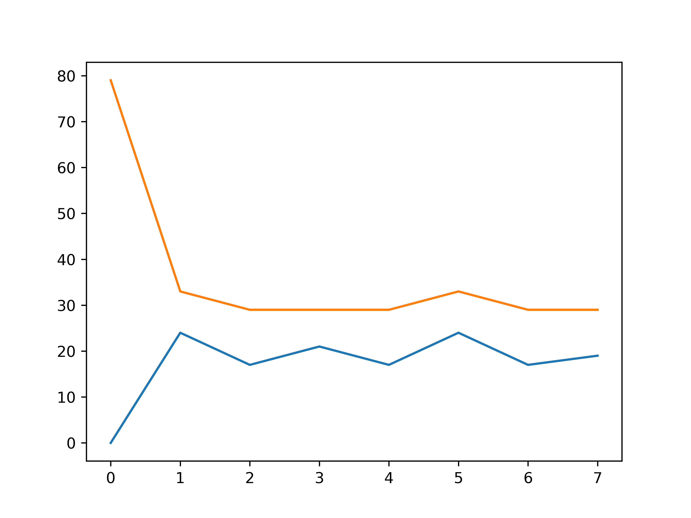

## 数据: `data/`

1. all-half.pre.full压缩一半-原来的数据

2. all-half.pre.full压缩一半-和声生成
    
3. 暂时替代all-half.pre.full压缩一半-旋律生成


## 代码: `src/`

0. 通用函数: 处理输入，提取旋律、调性等 -- `parse_input.py`

    不能直接运行。

1. 节奏模式 -- `1_rhythm_pattern.py`

    修改该文件中的数据文件名，如下。必须是第三类数据。

    ```python
    input_3 = parse_input("../data/3.txt", 3)
    ```

    *运行*：
    ```
    python3 1_rhythm_pattern.py
    ```

    e.g: [(0, 0, 44), (0, 1, 44), (0, 2, 44), (0, 3, 44), (0, 4, 44), (0, 5, 44), (0, 6, 44), (0, 7, 44), (0, 8, 44), (0, 9, 44), (0, 10, 44), (0, 11, 44), (0, 12, 44), (0, 13, 44), (0, 14, 44), (0, 15, 44), (0, 16, 44), (0, 17, 44), (0, 18, 44), (0, 19, 44), (0, 20, 44), (0, 21, 44), (0, 22, 44), (0, 23, 44), (0, 24, 44), (0, 25, 44), (0, 26, 44), (0, 27, 44), (0, 28, 44), (0, 29, 44), (0, 30, 44), (0, 31, 44), (0, 32, 44), (0, 33, 44), (0, 34, 44), (0, 35, 44), (0, 36, 44), (0, 37, 44), (0, 38, 44), (0, 39, 44), (0, 40, 44), (0, 41, 44), (0, 42, 44), (0, 43, 44), (7, 44, 16), (7, 45, 16), (7, 46, 16), (7, 47, 16), (7, 48, 16), (7, 49, 16), (7, 50, 16), (7, 51, 16), (7, 52, 16), (7, 53, 16), (7, 54, 16), (7, 55, 16), (7, 56, 16), (7, 57, 16), (7, 58, 16), (7, 59, 16), (19, 60, 12), (19, 61, 12), (19, 62, 12), (19, 63, 12), (19, 64, 12), (19, 65, 12), (19, 66, 12), (19, 67, 12), (19, 68, 12), (19, 69, 12), (19, 70, 12), (19, 71, 12), (21, 72, 4), (21, 73, 4), (21, 74, 4), (21, 75, 4), (19, 76, 12), (19, 77, 12), (19, 78, 12), (19, 79, 12), (19, 80, 12), (19, 81, 12), (19, 82, 12), (19, 83, 12), (19, 84, 12), (19, 85, 12), (19, 86, 12), (19, 87, 12), (17, 88, 4), (17, 89, 4), (17, 90, 4), (17, 91, 4), (16, 92, 16), (16, 93, 16), (16, 94, 16), (16, 95, 16), (16, 96, 16), (16, 97, 16), (16, 98, 16), (16, 99, 16), (16, 100, 16), (16, 101, 16), (16, 102, 16), (16, 103, 16), (16, 104, 16), (16, 105, 16), (16, 106, 16), (16, 107, 16), (12, 108, 8), (12, 109, 8), (12, 110, 8), (12, 111, 8), (12, 112, 8), (12, 113, 8), (12, 114, 8), (12, 115, 8), (14, 116, 4), (14, 117, 4), (14, 118, 4), (14, 119, 4), (16, 120, 4), (16, 121, 4), (16, 122, 4), (16, 123, 4), (17, 124, 12), (17, 125, 12), (17, 126, 12), (17, 127, 12), (17, 128, 12), (17, 129, 12), (17, 130, 12), (17, 131, 12), (17, 132, 12), (17, 133, 12), (17, 134, 12), (17, 135, 12), (19, 136, 4), (19, 137, 4), (19, 138, 4), (19, 139, 4), (17, 140, 12), (17, 141, 12), (17, 142, 12), (17, 143, 12), (17, 144, 12), (17, 145, 12), (17, 146, 12), (17, 147, 12), (17, 148, 12), (17, 149, 12), (17, 150, 12), (17, 151, 12), (16, 152, 4), (16, 153, 4), (16, 154, 4), (16, 155, 4), (14, 156, 16), (14, 157, 16), (14, 158, 16), (14, 159, 16), (14, 160, 16), (14, 161, 16), (14, 162, 16), (14, 163, 16), (14, 164, 16), (14, 165, 16), (14, 166, 16), (14, 167, 16), (14, 168, 16), (14, 169, 16), (14, 170, 16), (14, 171, 16), (7, 172, 16), (7, 173, 16), (7, 174, 16), (7, 175, 16), (7, 176, 16), (7, 177, 16), (7, 178, 16), (7, 179, 16), (7, 180, 16), (7, 181, 16), (7, 182, 16), (7, 183, 16), (7, 184, 16), (7, 185, 16), (7, 186, 16), (7, 187, 16), (16, 188, 12), (16, 189, 12), (16, 190, 12), (16, 191, 12), (16, 192, 12), (16, 193, 12), (16, 194, 12), (16, 195, 12), (16, 196, 12), (16, 197, 12), (16, 198, 12), (16, 199, 12), (17, 200, 4), (17, 201, 4), (17, 202, 4), (17, 203, 4), (16, 204, 12), (16, 205, 12), (16, 206, 12), (16, 207, 12), (16, 208, 12), (16, 209, 12), (16, 210, 12), (16, 211, 12), (16, 212, 12), (16, 213, 12), (16, 214, 12), (16, 215, 12), (14, 216, 4), (14, 217, 4), (14, 218, 4), (14, 219, 4), (12, 220, 16), (12, 221, 16), (12, 222, 16), (12, 223, 16), (12, 224, 16), (12, 225, 16), (12, 226, 16), (12, 227, 16), (12, 228, 16), (12, 229, 16), (12, 230, 16), (12, 231, 16), (12, 232, 16), (12, 233, 16), (12, 234, 16), (12, 235, 16), (16, 236, 16), (16, 237, 16), (16, 238, 16), (16, 239, 16), (16, 240, 16), (16, 241, 16), (16, 242, 16), (16, 243, 16), (16, 244, 16), (16, 245, 16), (16, 246, 16), (16, 247, 16), (16, 248, 16), (16, 249, 16), (16, 250, 16), (16, 251, 16), (9, 252, 4), (9, 253, 4), (9, 254, 4), (9, 255, 4), (9, 256, 8)]

2. 音乐轮廓 -- `2_music_contour.py`

    修改入口函数处的数据文件名，如下：

    ```python
    input_2 = parse_input("../data/2.txt", 2)
    input_3 = parse_input("../data/3.txt", 3)
    ```

    *运行*：

    ```
    python3 2_music_contour.py
    ```

    e.g: [([0, 24, 17, 21], [0, 24, -7, 4], [0, 24, -31, 11]), ([79, 33, 29, 29], [0, -46, -4, 0], [0, -46, 42, 4])]

    最低音和最高音走向: (蓝色: LL, 橙色: LH)
    
    前512个旋律音符:
    

    全部:
    
