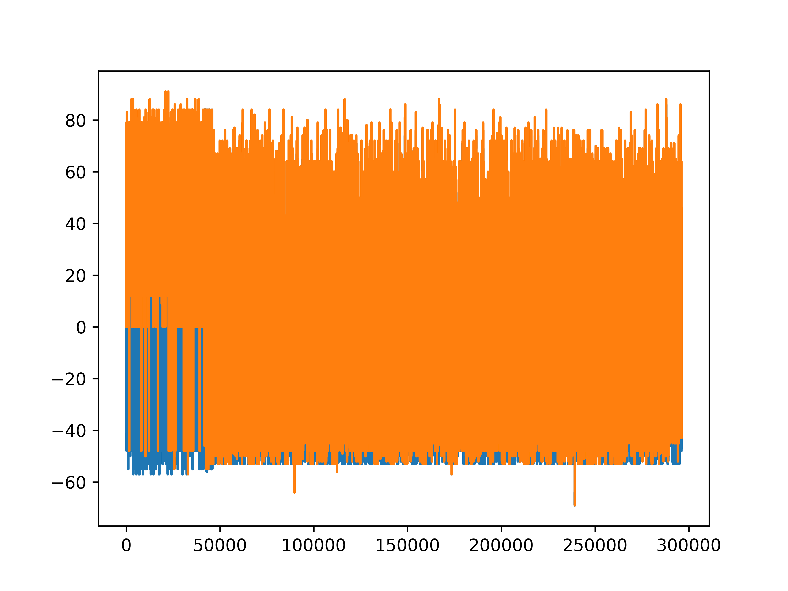

## 数据: `data/`

1. all-half.pre.full压缩一半-原来的数据

2. all-half.pre.full压缩一半-和声生成
    
3. 暂时替代all-half.pre.full压缩一半-旋律生成


## 代码: `src/`

0. 通用函数: 处理输入，提取旋律、调性等 -- `parse_input.py`

    不能直接运行。

1. 节奏模式 -- `1_rhythm_pattern.py`

    修改该文件中的数据文件名，如下。必须是第三类数据。

    ```python
    input_3 = parse_input("../data/3.txt", 3)
    ```

    *运行*：
    ```
    python3 1_rhythm_pattern.py
    ```

    e.g: [(0, 0, 44), (7, 44, 16), (7, 60, 12), (9, 72, 4), (7, 76, 12), (5, 88, 4), (4, 92, 16), (0, 108, 8), (2, 116, 4), (4, 120, 4), (5, 124, 12), (7, 136, 4), (5, 140, 12), (4, 152, 4), (2, 156, 16), (7, 172, 16), (4, 188, 12), (5, 200, 4), (4, 204, 12), (2, 216, 4), (0, 220, 16), (4, 236, 16), (9, 252, 4)]

2. 音乐轮廓 -- `2_music_contour.py`

    修改入口函数处的数据文件名，如下：

    ```python
    input_2 = parse_input("../data/2.txt", 2)
    input_3 = parse_input("../data/3.txt", 3)
    ```

    *运行*：

    ```
    python3 2_music_contour.py
    ```

    e.g: [([0, 0, 28, 24, 24, 12, 24, 21], [0, 0, 28, -4, 0, -12, 12, -3], [0, 0, 28, -32, 4, -12, 24, -15]), ([0, 79, 33, 29, 29, 21, 29, 28], [0, 79, -46, -4, 0, -8, 8, -1], [0, 79, -125, 42, 4, -8, 16, -9])]

    最低音和最高音走向: (蓝色: LL, 橙色: LH)
    
    前256个旋律音符:
    

    全部:
    
